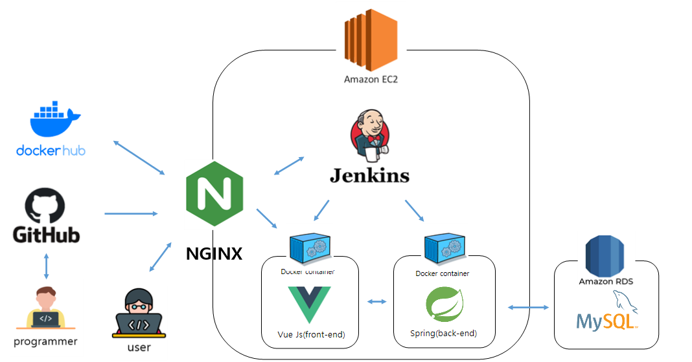
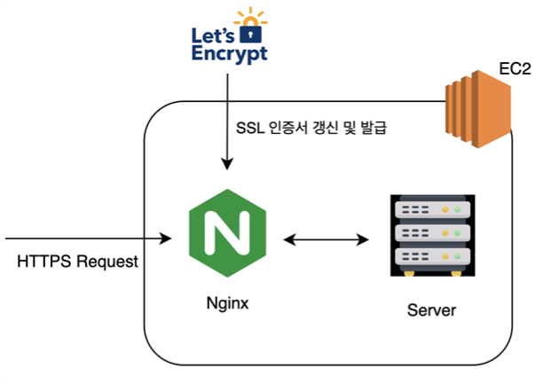
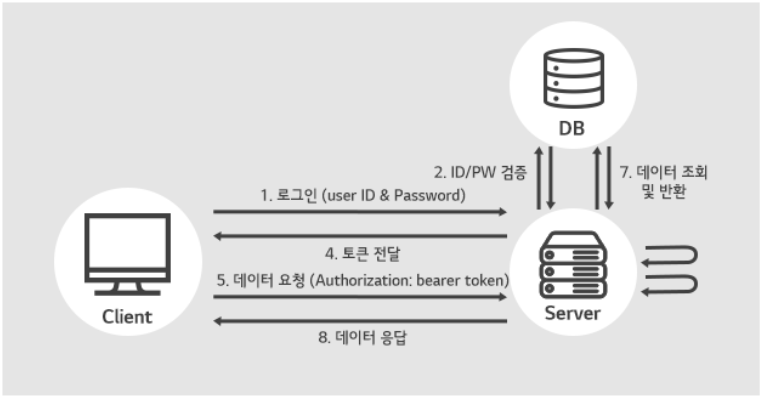
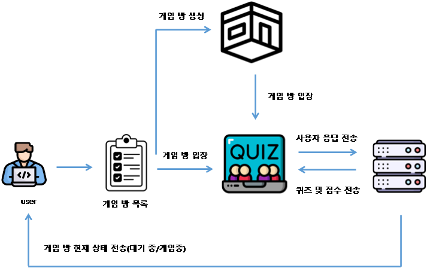
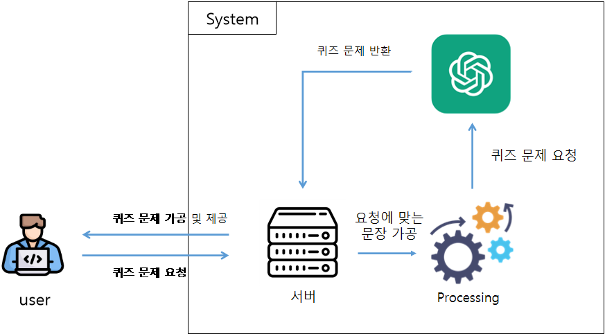

# 🕹 퀴즈 챌린지 

> 퀴즈 게임을 통한 흥미로운 교육 서비스 제공  
> 각종 다양한 분야에 대한 퀴즈 게임 서비스 제공
>  [퀴즈 챌린지 프론트 엔드 링크](https://github.com/0320kangk/quiz_challenge_front.git)

## 📕 프로젝트 목적 및 내용

+ 프로젝트 목적   
  + 흥미로운 학습 및 교육 서비스 제공
  + 실시간 퀴즈 문제 생성을 통한 다양한 문제 풀이 경험 제공
+ 프로젝트 내용
  + open ai를 통한 4지선다 및 OX 퀴즈 문제 제공
  + 싱글 퀴즈 게임 서비스 제공
  + 웹 소켓을 통한 멀티 퀴즈 게임 서비스 제공

## ⚙ 프로젝트 구조

## 📝 주요 업무 및 상세 역할

+ 주요 업무
  + 풀 스택 개발 (개인 프로젝트)
+ 작업 기간
  + 2024 06 ~ 2024 07 (1개월)
+ 상세 역할
  + 프론트 엔드 개발
  + 백 엔드 API 서비스 개발
  + JWT를 통한 로그인 서비스 구현
  + NGINX를 통한 HTTPS 서비스 구현
  + Open AI GPT-3.5 를 통한 퀴즈 문제 생성 로직 구현
  + Jenkins를 통한 CI/CD 구축
  + DB 설계 및 구현
  + Web Socket을 통한 게임 서비스 구현

## 🤝유지보수 툴

# ⚙️ 기술 스택

### Environment

### Front-End

### Back-End

### API

### 프로젝트 ERD

## 🛠 주요 기술 

+ HTTPS
  + Nginx를 이용하여 HTTPS 설정
  + 무료 SSL 인증서 Let’sEncrypt 를 받아 HTTPS 사용
  + Nginx가 프록시 서버 역할을 하게 하여 외부로 부터 서버를 숨겨 보안을 강화

 
 
 

+ JWT
  + Client가 Server로 로그인 요청을 보내면 Client에게 JWT 토큰을 발급.
  + 만약 Client가 API를 통해 접근하게 되면 JWT토큰을 함께 전달하며, Server가 토큰을 검증한 후 Client에게 응답을 전송.

 
 
 

+ WebSocket
  + 단체 퀴즈 기능에서 실시간 소통을 위해 socket 통신이 사용. 
  + 게임방이 추가되거나 유저가 게임방을 나가는 등 방 정보에 변동 사항이 생긴다면, 서버에 전달. 서버가 해당 유저가 퀴즈를 진행할 때 서버에서 퀴즈가 전송되고, 유저는 서버로 퀴즈 정답을 전송.

 
 
 

+ Open AI Chat GPT-3.5
  + User가 원하는 퀴즈 문제 요청
  + User 요청에 대하여 서버는 Chat GPT-3.5 요청에 최적화 된 문장 생성
  + 서버는 Chat Gpt-3.5 로 부터 퀴즈 문제를 받은 후 가공하여 User에게 제공

